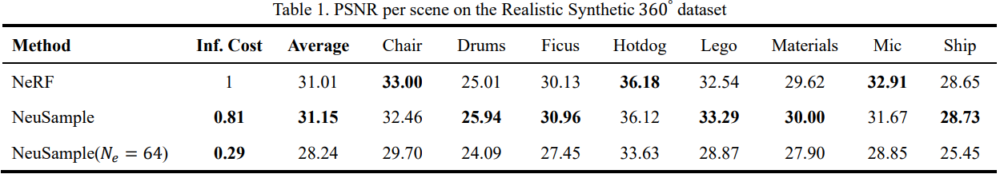
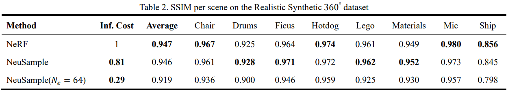
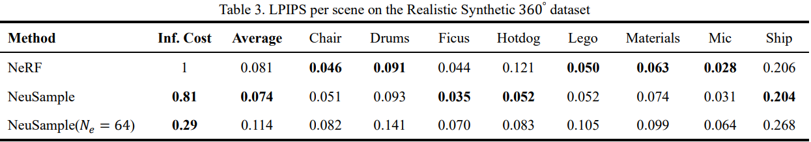

# JNeuSample

*NeuSample implemented on Jittor*

*Replace coarse-to-fine, hierarchical sampling procedure by a neural sample field*

## Reference 

Paper: [NeuSample: Neural Sample Field for Efficient View Synthesis](https://arxiv.org/pdf/2111.15552.pdf)  

## Pipeline

## Sample Field

  

## Training 

  <pre><code>
    mpirun -np 4 python main.py --stage train --obj_class lego
  </code></pre>

Some models are provided in folder **pretrained**
## Comparison
Experiment conducted on one RTX3090 GPU takes around 18 hours for each class.  

  
  
  
  
   
* “Inf. Cost” denotes the relative inference time cost compared with NeRF.  
* "Ne" of NeuSample denotes the sample number of the extracted sample field.  

***   

