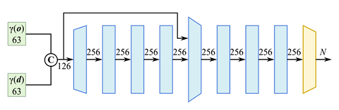

# JNeuSample

*NeuSample implemented on Jittor*

*Replace coarse-to-fine, hierarchical sampling procedure by a neural sample field*

## Reference 

Paper: [NeuSample: Neural Sample Field for Efficient View Synthesis](https://arxiv.org/pdf/2111.15552.pdf)  

## Pipeline

## Sample Field
<p align = "center">
  
</p>

## Training 

```
mpirun -np 4 python main.py --stage train --obj_class lego
```

Some models are provided in folder **pretrained**
## Comparison
Experiment conducted on one RTX3090 GPU takes around 18 hours for each class.  
<h4>NeuSample(N=192)</h4>
<table border="1" width="1000px" cellspacing="20">
<tr>
  <th rowspan="2" align="center" valign="center">Class</th>
  <th colspan="2" align="center" valign="center">PSNR</th>
  <th colspan="2" align="center" valign="center">SSIM</th>
  <th colspan="2" align="center" valign="center">LPIPS</th>
</tr>
<tr>
  <td align="center" valign="center">Paper</td>
  <td align="center" valign="center">This Code</td>
  <td align="center" valign="center">Paper</td>
  <td align="center" valign="center">This Code</td>
  <td align="center" valign="center">Paper</td>
  <td align="center" valign="center">This Code</td>
</tr>
<tr>
  <td align="center" valign="center">Chair</td>
  <td align="center" valign="center"><b>33.02</b></td>
  <td align="center" valign="center">32.46</td>
  <td align="center" valign="center"><b>0.968</b></td>
  <td align="center" valign="center">0.961</td>
  <td align="center" valign="center"><b>0.045</b></td>
  <td align="center" valign="center">0.051</td>
</tr>
<tr>
  <td align="center" valign="center">Drums</td>
  <td align="center" valign="center">24.99</td>
  <td align="center" valign="center"><b>25.94</b></td>
  <td align="center" valign="center">0.924</td>
  <td align="center" valign="center"><b>0.928</b></td>
  <td align="center" valign="center"><b>0.091</b></td>
  <td align="center" valign="center">0.093</td>
</tr>
<tr>
  <td align="center" valign="center">Ficus</td>
  <td align="center" valign="center">30.72</td>
  <td align="center" valign="center"><b>30.96</b></td>
  <td align="center" valign="center">0.968</td>
  <td align="center" valign="center"><b>0.971</b></td>
  <td align="center" valign="center">0.036</td>
  <td align="center" valign="center"><b>0.035</b></td>
</tr>
<tr>
  <td align="center" valign="center">Hotdog</td>
  <td align="center" valign="center"><b>36.29</b></td>
  <td align="center" valign="center">36.12</td>
  <td align="center" valign="center"><b>0.977</b></td>
  <td align="center" valign="center">0.972</td>
  <td align="center" valign="center"><b>0.043</b></td>
  <td align="center" valign="center">0.052</td>
</tr>
<tr>
  <td align="center" valign="center">Lego</td>
  <td align="center" valign="center">33.17</td>
  <td align="center" valign="center"><b>33.29</b></td>
  <td align="center" valign="center"><b>0.965</b></td>
  <td align="center" valign="center">0.962</td>
  <td align="center" valign="center"><b>0.048</b></td>
  <td align="center" valign="center">0.052</td>
</tr>
<tr>
  <td align="center" valign="center">Materials</td>
  <td align="center" valign="center">29.66</td>
  <td align="center" valign="center"><b>30.00</b></td>
  <td align="center" valign="center">0.949</td>
  <td align="center" valign="center"><b>0.952</b></td>
  <td align="center" valign="center"><b>0.073</b></td>
  <td align="center" valign="center">0.074</td>
</tr>
<tr>
  <td align="center" valign="center">Mic</td>
  <td align="center" valign="center"><b>32.68</b></td>
  <td align="center" valign="center">31.67</td>
  <td align="center" valign="center"><b>0.980</b></td>
  <td align="center" valign="center">0.952</td>
  <td align="center" valign="center"><b>0.027</b></td>
  <td align="center" valign="center">0.031</td>
</tr>
<tr>
  <td align="center" valign="center">Ship</td>
  <td align="center" valign="center">28.65</td>
  <td align="center" valign="center"><b>28.73</b></td>
  <td align="center" valign="center"><b>0.863</b></td>
  <td align="center" valign="center">0.845</td>
  <td align="center" valign="center"><b>0.183</b></td>
  <td align="center" valign="center">0.204</td>
</tr>
<tr>
  <td align="center" valign="center">Average</td>
  <td align="center" valign="center">31.15</td>
  <td align="center" valign="center">31.15</td>
  <td align="center" valign="center"><b>0.949</b></td>
  <td align="center" valign="center">0.946</td>
  <td align="center" valign="center"><b>0.068</b></td>
  <td align="center" valign="center">0.074</td>
</tr>
<tr>
  <td align="center" valign="center">Inference Time Cost</td>
  <td colspan="3" align="center" valign="center">/</td>
  <td colspan="3" align="center" valign="center">12.71s per image</td>
</tr>
</table>


<h4>Extracted Sample Field(N=64)</h4>
<table border="1" width="1000px" cellspacing="20">
<tr>
  <th rowspan="2" align="center" valign="center">Class</th>
  <th colspan="2" align="center" valign="center">PSNR</th>
  <th colspan="2" align="center" valign="center">SSIM</th>
  <th colspan="2" align="center" valign="center">LPIPS</th>
</tr>
<tr>
  <td align="center" valign="center">Paper</td>
  <td align="center" valign="center">This Code</td>
  <td align="center" valign="center">Paper</td>
  <td align="center" valign="center">This Code</td>
  <td align="center" valign="center">Paper</td>
  <td align="center" valign="center">This Code</td>
</tr>
<tr>
  <td align="center" valign="center">Chair</td>
  <td align="center" valign="center"><b>29.96</b></td>
  <td align="center" valign="center">29.70</td>
  <td align="center" valign="center"><b>0.941</b></td>
  <td align="center" valign="center">0.936</td>
  <td align="center" valign="center"><b>0.077</b></td>
  <td align="center" valign="center">0.082</td>
</tr>
<tr>
  <td align="center" valign="center">Drums</td>
  <td align="center" valign="center">23.43</td>
  <td align="center" valign="center"><b>24.09</b></td>
  <td align="center" valign="center">0.0897</td>
  <td align="center" valign="center"><b>0.9000</b></td>
  <td align="center" valign="center"><b>0.133</b></td>
  <td align="center" valign="center">0.141</td>
</tr>
<tr>
  <td align="center" valign="center">Ficus</td>
  <td align="center" valign="center"><b>27.53</b></td>
  <td align="center" valign="center">27.45</td>
  <td align="center" valign="center">0.942</td>
  <td align="center" valign="center"><b>0.946</b></td>
  <td align="center" valign="center">0.073</td>
  <td align="center" valign="center"><b>0.070</b></td>
</tr>
<tr>
  <td align="center" valign="center">Hotdog</td>
  <td align="center" valign="center"><b>34.41</b></td>
  <td align="center" valign="center">33.63</td>
  <td align="center" valign="center"><b>0.966</b></td>
  <td align="center" valign="center">0.972</td>
  <td align="center" valign="center"><b>0.067</b></td>
  <td align="center" valign="center">0.083</td>
</tr>
<tr>
  <td align="center" valign="center">Lego</td>
  <td align="center" valign="center"><b>29.14</b></td>
  <td align="center" valign="center">28.87</td>
  <td align="center" valign="center"><b>0.931</b></td>
  <td align="center" valign="center">0.925</td>
  <td align="center" valign="center"><b>0.097</b></td>
  <td align="center" valign="center">0.105</td>
</tr>
<tr>
  <td align="center" valign="center">Materials</td>
  <td align="center" valign="center">27.76</td>
  <td align="center" valign="center"><b>27.90</b></td>
  <td align="center" valign="center">0.927</td>
  <td align="center" valign="center"><b>0.930</b></td>
  <td align="center" valign="center"><b>0.095</b></td>
  <td align="center" valign="center">0.099</td>
</tr>
<tr>
  <td align="center" valign="center">Mic</td>
  <td align="center" valign="center"><b>29.42</b></td>
  <td align="center" valign="center">28.85</td>
  <td align="center" valign="center"><b>0.964</b></td>
  <td align="center" valign="center">0.957</td>
  <td align="center" valign="center"><b>0.057</b></td>
  <td align="center" valign="center">0.064</td>
</tr>
<tr>
  <td align="center" valign="center">Ship</td>
  <td align="center" valign="center"><b>25.47</b></td>
  <td align="center" valign="center">25.45</td>
  <td align="center" valign="center"><b>0.819</b></td>
  <td align="center" valign="center">0.798</td>
  <td align="center" valign="center"><b>0.238</b></td>
  <td align="center" valign="center">0.268</td>
</tr>
<tr>
  <td align="center" valign="center">Average</td>
  <td align="center" valign="center"><b>28.39</b></td>
  <td align="center" valign="center">28.24</td>
  <td align="center" valign="center"><b>0.923</b></td>
  <td align="center" valign="center">0.919</td>
  <td align="center" valign="center"><b>0.105</b></td>
  <td align="center" valign="center">0.114</td>
</tr>
<tr>
  <td align="center" valign="center">Inference Time Cost</td>
  <td colspan="3" align="center" valign="center">/</td>
  <td colspan="3" align="center" valign="center">4.56s per image</td>
</tr>
</table>

   


  
***   


